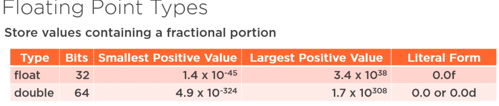

# Java stuff ☕️

## Table of Contents

- [About](#about)
- [Getting Started](#getting_started)

## About <a name = "about"></a>

Basics stuff in java, nothing more!

## Primetime data types

We have four categories in `Java` primitive types:

- `Integers`
- `Floating Point`
- `Characters`
- `Booleans`

The difference is ho much memory they can store.

**Integers types**
| Type | Bits | Min Value | Max Value | Litteral Form |
| ----- | ---- | --------------------- | -------------------- | ------------- |
| Byte | 8 | -128 | 127 | O |
| short | 16 | -32768 | 32767 | O |
| int | 32 | -2147483648 | 2147483647 | O |
| long | 64 | -92233720368554775808 | 92233720368554775807 | OL |

```java
  byte myByte = 23;
  short myShort = 1230;
  int myInt = 9628200;
  long myLong = 5870032323L;
```

**Floating types**



```java
  float myFloat = 45.3f;
  float myFloat2 = -45.3f;
  double myDouble = 0.0000001d;
```

**Characters types**
Stores single unicode character
for unicode points use `\u `flowed by four digit hex value.

```java
  char regularU =  'U';
  char accentedU = '\u00DA'; // Ù

```

**Boolean type**
Simply stores true or false like another programing language.

```java
  boolean yes = true;
  boolean no = false;
```
