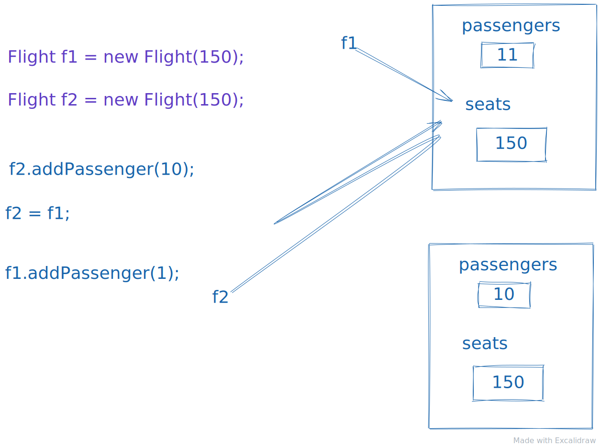

# Java stuff ☕️

## Table of Contents

- [About](#about)
- [Getting Started](#getting_started)
- [Primitive types](#primitive_types)
- [Strings](#strings)
- [Lists](#lists)
- [Classes](#classes)

## About <a name = "about"></a>

Basics stuff in java, nothing more!

## Primetime data types <a name = "primitive_types"></a>

We have four categories in `Java` primitive types:

- `Integers`
- `Floating Point`
- `Characters`
- `Booleans`

The difference is ho much memory they can store.

**Integers types**
| Type | Bits | Min Value | Max Value | Litteral Form |
| ----- | ---- | --------------------- | -------------------- | ------------- |
| Byte | 8 | -128 | 127 | O |
| short | 16 | -32768 | 32767 | O |
| int | 32 | -2147483648 | 2147483647 | O |
| long | 64 | -92233720368554775808 | 92233720368554775807 | OL |

```java
  byte myByte = 23;
  short myShort = 1230;
  int myInt = 9628200;
  long myLong = 5870032323L;
```

**Floating types**


```java
  float myFloat = 45.3f;
  float myFloat2 = -45.3f;
  double myDouble = 0.0000001d;
```

**Characters types**
Stores single unicode character
for unicode points use `\u `flowed by four digit hex value.

```java
  char regularU =  'U';
  char accentedU = '\u00DA'; // Ù

```

**Boolean type**
Simply stores true or false like another programing language.

```java
  boolean yes = true;
  boolean no = false;
```

Primitive data types is stored by value in `Java` and not by reference like in some languages.
So if we pass some variables to a method and try to mutate them in there we will not change the variables that is one scope above.

```java
  int a = 22;
  int b = 33;

  static void swap(int a, int b) {
    int temp = a;
    a = b;
    b = temp;
  }

  // if we pass a and be we will still have the same result

```

## Strings <a name="strings"></a>

Stores a sequence of unicode characters

- Literals are enclosed in double quotes
- Values can be concatenated using + and +=
- Strings are immutable
- Hols a reference to the instance of a string
- each time concatenate a new string with the existing one will allocate new memory on the heap.

```java
  String name = "Marcell";
  String hello = "Hello";

  String helloMarcell = Hello + " " name;

  String shout = helloMarcell + "!!!";
```

## Lists <a name="lists"></a>

The `ArrayList` class is a dynamic array, which can be found in the java.util package.

The difference between a built-in array and an `ArrayList` in `Java`. The built in Array in Java is a static array while the `ArrayList` is dynamic
and we can add remove elements to the list without creating a new one.

### Labeled string format

This is a really cool feature in `Java` where we can label the arguments when formatting a string.

```java
int a = 2, b = 22, c = 212;

//    Labeled arguments
String s1 = String.format("%3$d, %2$d, %1$d", c, a, b);

// 22 , 2 , 212
```

## Classes <a name="classes"></a>

Classes in `java` are not primitive types they are stored by reference and are reference typed.
For example:

```java
  Person p1 = new Person("Bob","Smith");
  Person p2 = new Person("Bob","Smith");

  p1 == p2; // false
  p1.equals(p2); // false
```

sore what if we resign the `p1` to `p2` like this.

```java
  p1 = p2;
```

now `p1` will point to `p2` as a reference and `p1==p2` will be `true` .

Here is a another example:

```java
    Flight f1 = new Flight(150);
    Flight f2 = new Flight(150);

    print(f1.toString()); // {passengers:0, seats:150}
    f2 = f1;
    f2.addPassenger(100);
    print(f1.toString()); // {passengers:100, seats:150}
    print(f2.toString()); // {passengers:100, seats:150}
```



## static fields <a name="static-fields"></a>

```java
public class Flight {

  int passengers, seats;
  private static int allPassengers;
  String destination;

  public Flight(int seats) {
    this.passengers = 0;
    this.seats = seats;
    this.destination = "";
  }

  public static int getAllPassengers() {
    return allPassengers;
  }

  public static void resetAllPassengers() {
    allPassengers = 0;
  }

  void addOnePassenger() {
    if (passengers < seats) {
      passengers += 1;
      allPassengers += 1;
    }
  }

  void updateSeats(int seats) {
    this.seats = seats;
  }

  void setDestination(String destination) {
    this.destination = destination;
  }

  public int getPassengers() {
    return passengers;
  }

  public int getSeats() {
    return seats;
  }

  public String getDestination() {
    return destination;
  }

  @Override
  public String toString() {
    return "Flight{" +
           "passengers=" + passengers +
           ", seats=" + seats +
           ", destination='" + destination + '\'' +
           '}';
  }
}

```

Now when we create our instances of the `Flight` class, using static methods.

```java
    Flight.resetAllPassengers();
    Flight f = new Flight(21);
    f.addOnePassenger();
    f.addOnePassenger();
    f.addOnePassenger();
    f.getPassengers() // 3

    Flight r = new Flight(111);
    r.addOnePassenger();

    r.getPassengers(); //1
    Flight.getAllPassengers(); // 4
```

## function overloading <a name="function overloading"></a>

When using function overloading it is important to remember that we need somehow tell the compiler what differs the first method from the second one.
In this case the difference is that the first `add` method takes in 2 integers, meanwhile the second `add` method takes in a integer and a float.
If we would take in the same parameters in this case would have a compile error.

```java
package com.company.masiu;

public class Math {

  public int add(int a, int b) {
    return a + b;
  }

  public float add(int a, float b) {
    return a + b;
  }
}


int res = m.add(10, 12);
float res2 = m.add(10,10.5f);


```

Function overloading works similar like optional parameters in JavaScript, that his how would like see it.
